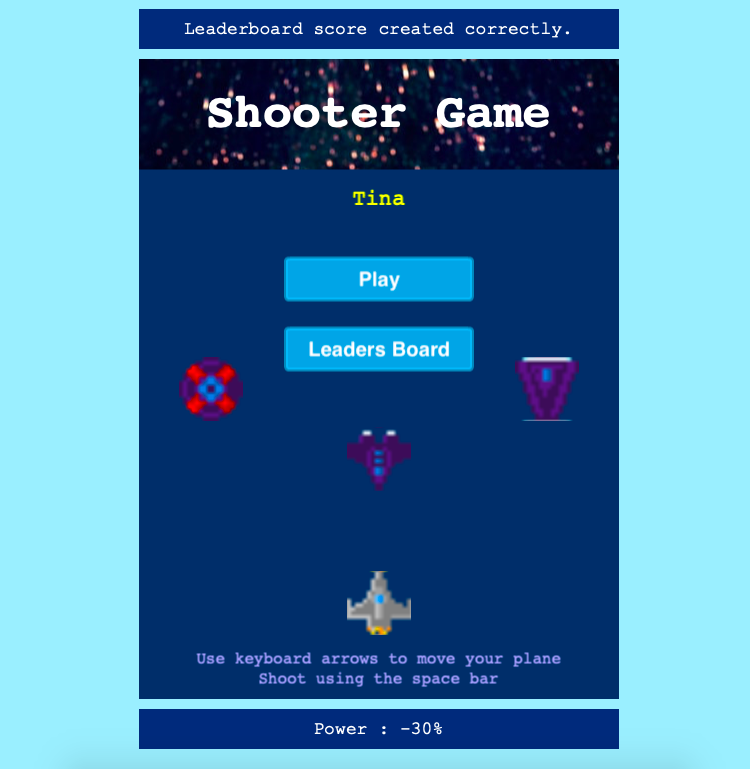
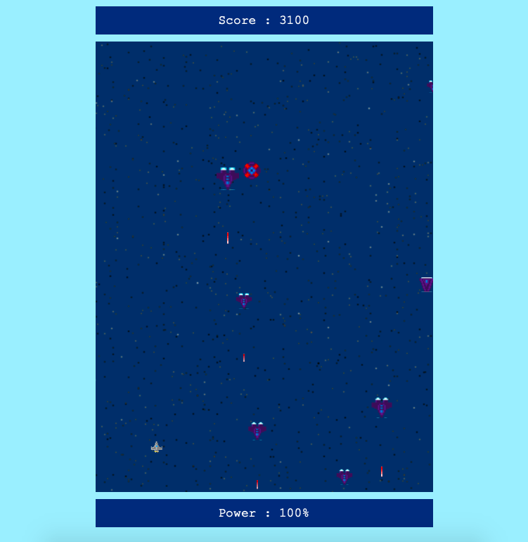
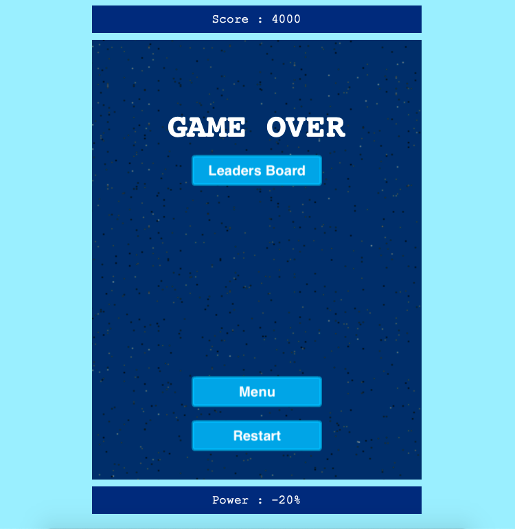
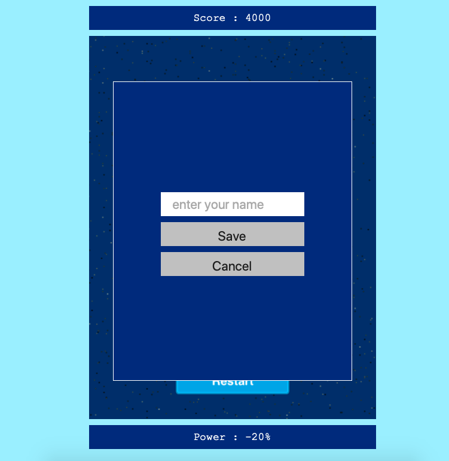
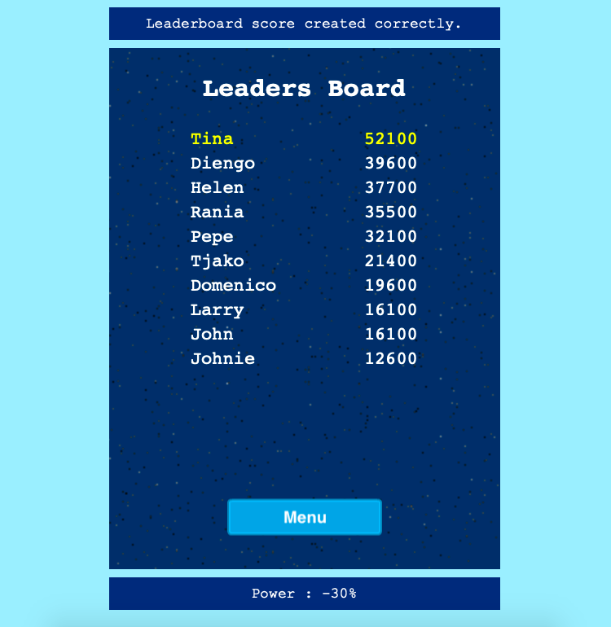

# Shooter Game

<!--
*** Thanks for checking out this README Template. If you have a suggestion that would
*** make this better, please fork the repo and create a pull request or simply open
*** an issue with the tag "enhancement".
*** Thanks again! Now go create something AMAZING! :D
-->

<!-- PROJECT SHIELDS -->
<!--
*** I'm using markdown "reference style" links for readability.
*** Reference links are enclosed in brackets [ ] instead of parentheses ( ).
*** See the bottom of this document for the declaration of the reference variables
*** for contributors-url, forks-url, etc. This is an optional, concise syntax you may use.
*** https://www.markdownguide.org/basic-syntax/#reference-style-links
-->

[![Contributors][contributors-shield]][contributors-url]
[![Forks][forks-shield]][forks-url]
[![Stargazers][stars-shield]][stars-url]
[![Issues][issues-shield]][issues-url]

<!-- PROJECT LOGO -->
<br />
<p align="center">
  <a href="https://github.com/ioanniskousis/ShooterGame">
    
  </a>
  
  <h3 align="center">The Shooter Game Application</h3>
  
  <p align="center">
    This project is part of the Microverse curriculum in JavaScript course!
    <br />
    <a href="https://github.com/ioanniskousis/ShooterGame"><strong>Explore the docs</strong></a>
    <br />
    <a href="https://ioanniskousis.github.io/ShooterGame/">Live Version</a>
    <br />
    <a href="https://github.com/ioanniskousis/ShooterGame/issues">Report Bug</a>
    <span> - </span>
    <a href="https://github.com/ioanniskousis/ShooterGame/issues">Request Feature</a>
  </p>
</p>

This is an arcade Shooter Game application where the user controls a flying vehicle armed with weapons to shoot against enemy vehicles coming down from the top of the screen

<hr />

<!-- TABLE OF CONTENTS -->

## Table of Contents

- [Screen Shots](#screen-shots)
- [About the Project](#about-the-project)
- [Application Instructions](#application-instructions)
- [Live Version](#live-version)
- [System Requierments](#system-requierments)
- [Development](#development)
- [Dependencies](#dependencies)
- [Built With](#built-with)
- [Contributors](#contributors)
- [Acknowledgements](#acknowledgements)

## Screen Shots  
### Entry Scene  

<hr />
### Battle Scene  

<hr />
### Game Over Scene  

<hr />
### Game Over Scene User Name Input 

<hr />
### leadersboard Scene  

<hr />
<!-- ABOUT THE PROJECT -->

## About The Project  

  The project uses the Phaser3 game engine and almost all the code is related to this framework.  
  The entry point which is index.js
  The main control is applied in index.js.  
  Partially,  
    - the model for countries is implemented in countriesDB.js creating a data set of countries stored in dist/countries.json  
    - the model for cities is implemented in citiesDB.js creating a data set of cities stored in dist/cities.json   
    - the main consept is controlled in index.js  
      - first a callback function (citySelected) is supplied to the interface elements that represent a city (city buttons)  
      - the callback receives the requested city.  
      - calls an asynchronous API fetch procedure provided a callback (cityWeatherArrived) to receive the weather data for the requested city  
      - the city weather data that arrived are passed to the interface module cityWeatherInterface.js   
    - the module cityWeatherInterface.js contains procedures to update the interface information with the new data  

  * An initial population is performed when the localStorage is empty of Favorites by data held in seed.js.  
  * Shorthand commands for creating and accessing elements are used and are held in utils.js.  

<hr/>

<!-- ABOUT THE PROJECT -->

## Application Instructions  

  * The application comes with some initial data about the favotires cities held in seed.js file  
  * Also, there are 200.000 locations to be invoked  

  * The favorite cities list is on the left. Clicking a city button  an http request is generated to get information about the weather at the requested city.  

  </img>

  * the received data are passed to the weather interface (cityWeatherInterface).  

  </img>

  * click the units button at the top-right to toggle between Fahrenheit and Celcius  
  * play around selecting a particular country's cities and select a city to view their weather  

<hr/>

## Live Version

[GitHub Pages](https://ioanniskousis.github.io/ShooterGame/)

<hr/>

## System Requierments

  - JavaScript Enabled  
  - You need to Disable Cross-Origin-Restrictions from your browser if you want to open the index.html from your file system without using a server.  

<hr/>

## Development
  * Clone the project
  ```
    https://github.com/ioanniskousis/ShooterGame.git
    
    Use VSCode and Live Server to show index.html
    Since webpack is used, run 'npm run build' on you terminal before opening
  ``` 
<hr/>

## Dependencies

  please run
  ```
    npm run build
  ```
  to comply with the dependencies held in package.json
<hr/>

## Built With

This project was built using these technologies.

  - JavaScript (ES6)
  - HTML5
  - CSS3
  - webpack
  - APIs
  - Git - GitHub
  - ESLint
  - Stylelint
  - Stickler

<hr/>

<!-- CONTACT -->

## Contributors

:bust_in_silhouette:
​
## Ioannis Kousis

- Github: [@ioanniskousis](https://github.com/ioanniskousis)
- Twitter: [@ioanniskousis](https://twitter.com/ioanniskousis)
- Linkedin: [Ioannis Kousis](https://www.linkedin.com/in/jgkousis)
- E-mail: jgkousis@gmail.com
​
<hr/>
<!-- ACKNOWLEDGEMENTS -->

## Acknowledgements

  - [Microverse](https://www.microverse.org/)
  - [The Odin Project](https://www.theodinproject.com/)


<!-- MARKDOWN LINKS & IMAGES -->
<!-- https://www.markdownguide.org/basic-syntax/#reference-style-links -->

[contributors-shield]: https://img.shields.io/github/contributors/ioanniskousis/ShooterGame.svg?style=flat-square
[contributors-url]: https://github.com/ioanniskousis/ShooterGame/graphs/contributors
[forks-shield]: https://img.shields.io/github/forks/ioanniskousis/ShooterGame.svg?style=flat-square
[forks-url]: https://github.com/ioanniskousis/ShooterGame/network/members
[stars-shield]: https://img.shields.io/github/stars/ioanniskousis/ShooterGame.svg?style=flat-square
[stars-url]: https://github.com/ioanniskousis/ShooterGame/stargazers
[issues-shield]: https://img.shields.io/github/issues/ioanniskousis/ShooterGame.svg?style=flat-square
[issues-url]: https://github.com/ioanniskousis/ShooterGame/issues

